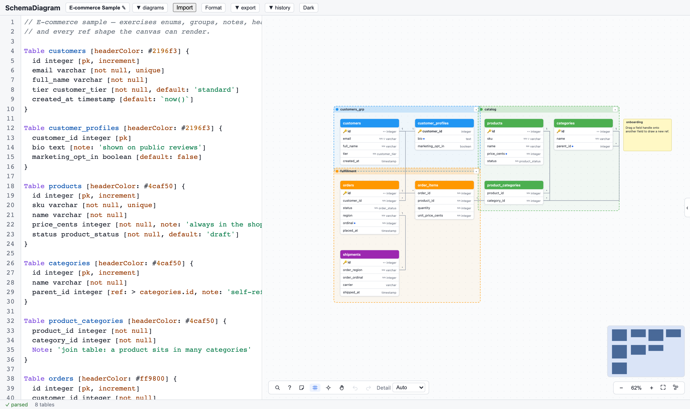

<div align="center">

# SchemaDiagram

**A local-first database diagram editor — write DBML on the left, watch your ER diagram render live on the right.**

[**Live Demo →**](https://msishariful.github.io/SchemaDiagram/)

[](https://github.com/msiShariful/SchemaDiagram/actions/workflows/deploy.yml)


[](LICENSE)



</div>

---

SchemaDiagram is a [dbdiagram.io](https://dbdiagram.io)-style editor that runs entirely in your browser. Diagrams are parsed, rendered, and persisted locally — **no account, no server, no data ever leaves your machine**.

## ✨ Features

### Editor
- **DBML editing** powered by CodeMirror 6 — syntax highlighting, schema-aware autocomplete, inline diagnostics, and a Problems panel
- **Whitespace-only formatter** that normalizes indentation without ever touching your comments or strings
- **Debounced background parsing** in a Web Worker — the UI never blocks, and the canvas always keeps rendering the last good parse while you type

### Canvas
- **Live ER diagram** with smooth pan / zoom / drag, snapping, marquee selection, and a minimap
- **Auto-layout** via ELK, plus manual positioning that survives table renames (field-signature reconciliation)
- **Ref authoring from the canvas** — draw a relationship between fields and the DBML is written for you; edit cardinality or delete refs from an edge popover
- **Table settings on the canvas** — rename tables and pick header colors; changes round-trip through the DBML text
- **Table groups** with collapse/expand, per-table hide, highlight mode, and `Cmd/Ctrl+K` quick search
- **Sticky notes** with colors and resizing for annotating your diagrams
- **Level-of-detail rendering** and viewport culling — large schemas stay fast

### Import & Export
- **Import** from DBML, PostgreSQL, MySQL, SQL Server, Oracle, and Snowflake DDL
- **Export** to SQL (PostgreSQL / MySQL / SQL Server / Oracle), SVG, PNG, and print-ready PDF
- **Portable project files** for backup and sharing

### Local-first persistence
- Diagrams autosave to **IndexedDB** with generation-stamped writes (no lost updates, no resurrection of deleted diagrams)
- **Snapshot history** panel to browse and restore earlier versions
- Graceful degradation to in-memory operation if storage is unavailable
- Light / dark theme with no flash-of-wrong-theme on load

## 🚀 Try It

**No install needed:** [msishariful.github.io/SchemaDiagram](https://msishariful.github.io/SchemaDiagram/)

Or run it locally:

```bash
git clone https://github.com/msiShariful/SchemaDiagram.git
cd SchemaDiagram
npm install
npm run dev
```

## 🧱 Tech Stack

| Layer | Technology |
|---|---|
| UI | React 19, TypeScript (strict) |
| State | zustand |
| Editor | CodeMirror 6 |
| DBML parsing | `@dbml/core` (in a Web Worker) |
| Auto-layout | elkjs |
| Canvas | Custom SVG renderer |
| Persistence | IndexedDB (`idb`) |
| Build / test | Vite, Vitest, Playwright |

## 🏗 Architecture

```
src/
├── core/      # Pure TypeScript — parsing, layout, model, persistence, converters
│              #   (zero React/zustand imports, fully unit-testable)
├── app/       # Store, app shell, dashboard, import/export, history
├── editor/    # CodeMirror integration — language, completion, diagnostics, text rewrites
└── canvas/    # SVG diagram — nodes, edges, groups, minimap, viewport math
```

Key design decisions:

- **One-way data flow:** keystrokes → debounced, latest-wins parse pipeline (Web Worker) → position reconciliation → canvas. Canvas interactions write *layout state only*; anything that must change text goes through a single editor-transaction bridge so undo history stays coherent.
- **Last good parse:** parse errors are the normal state while typing — the canvas never blanks, it shows a stale badge instead.
- **Performance contract:** pan/zoom/drag bypass React entirely (direct attribute writes + imperative edge re-routing); the store commits once per gesture.
- **Bundle discipline:** the ~2.7 MB DBML parser lives in a lazily-loaded worker chunk; a CI-enforced budget keeps the main chunk around 211 kB gzip.

## 🧪 Quality Gates

```bash
npm test              # Vitest unit suite
npm run test:e2e      # Playwright golden flows + performance budget
npm run check:bundle  # main-chunk size budget + lazy-lib leak detection
npm run build         # strict typecheck + production build
```

## 📄 License

[MIT](LICENSE) — free to use, modify, and distribute.

---

<div align="center">
Built by <a href="https://github.com/msiShariful">msiShariful</a>
</div>
